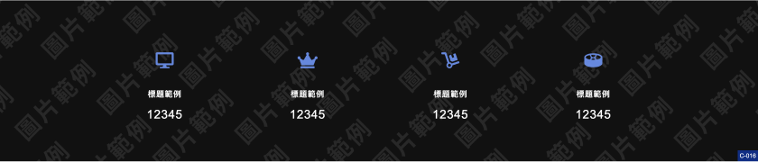

# Website Template 網站模板

 

### 介紹

- 名稱: [Websitemplate 1](https://pardnchiu.github.io/websitemplate-001/)
- 開發: [Pardn Chiu](https://facebook.com/chiuchingwei) / [信箱](mailto:chiuchingwei@icloud.com)
- 授權: [MIT License](./LICENSE)
- 源碼: https://github.com/pardnchiu/websitemplate-001

 

### 引用

- [Font Awesome 5.1](https://fontawesome.com)

 

### 畫面

| index |
|---|
|        |

| gallery |
|---|
|    |

| blog |
|---|
|    |

 

Copyright (c) 2022 [Pardn Ltd 帕登國際有限公司](https://facebook.com/pardnltd)
